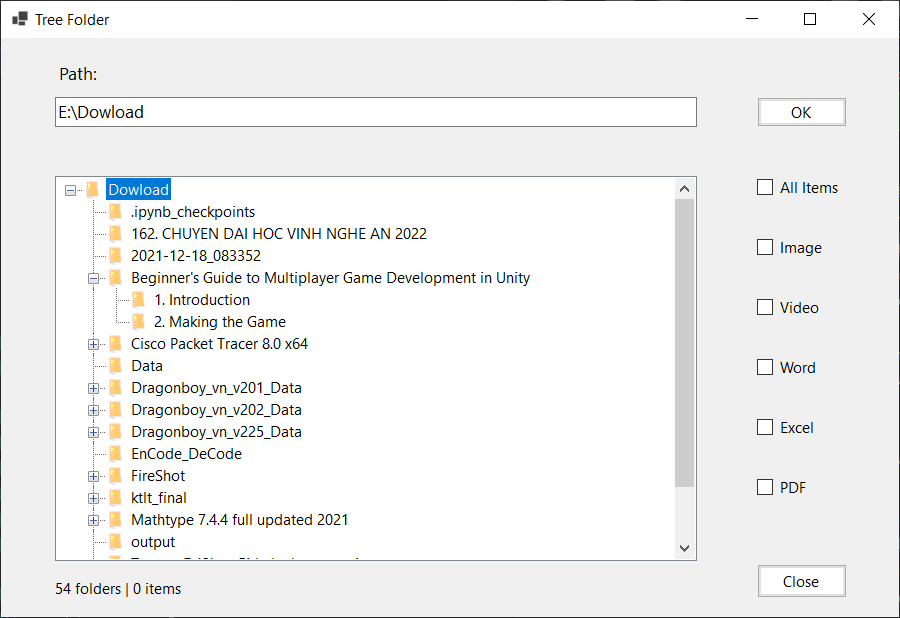

# Winform display and filter sub-folders and files.

The repository is a mini application of **Mediator** and **Visitor** Design Pattern.

You can find more information about structures in report.

To run the app, you must open Visual Studio and run the .sln file.
